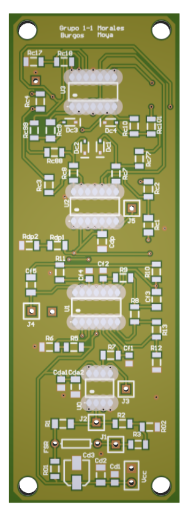

# Proyecto Cash Tester

## Objetivos preliminares
* Implementar una solución viable a la problemática que más de 595.288 personas sufren en el país al no poder identificar eficazmente la denominación de las monedas de referencia __Colombiana.__ Desarrollando desde el campo de trabajo de la ingeniería una respuesta a una problemática latente, apostándole a la inclusión y al desarrollo del país.

* Implementar un sistema, con uso de la electrónica que generé una respuesta sonora, que una persona con baja visión/invidente reconozca a partir de la denominación de la moneda en vigencia.

## Descripción del Diseño
El proyecto se compone de un sensor (transductor) de resistencia sensible a la fuerza. La señal del transductor es acondicionada a través de un amplificador de instrumentación y un filtro pasa bajos.  
La señal proveniente del filtro es pasada por un detector de picos encargado de retardar el pico de voltaje el tiempo suficiente para que un circuito comparador la detecte, la clasifique y entregue un determinado voltaje DC al último circuito de la cadena que es un VCO (Voltage Controlled Oscillator).  
Por último, el VCO variará una alerta sonora en frecuencia para así de esta manera identificar el valor de la moneda.

## Descripción circuitos y Esquemáticos

* Un sensor (transductor) el cual es una resistencia sensible a la fuerza (FSR - FlexiForce A101).
* Circuito de acondicionamiento de señal usando un puente de wheatstone asi como también un amplificador de instrumentación y un filtro pasa bajos.

### Esquemático Circuito Amplificador y Circuito de filtrado

  

* La señal proveniente del filtro pasa bajos pasada por un circuito detector de picos el cual se encarga de retardar/ampliar la duración del pico de voltaje
* La señal proveniente del detector de picos es enviada a un comparador para clasificar y crear un voltaje DC.

### Esquemático Circuito Detector de picos y Circuito Comparador 

  

### Montaje en Protoboard para pruebas

  

* El voltaje DC proveniente del comparador ingresa a un VCO el cual producirá una variación en frecuencia.  
* La frecuencia proveniente del VCO es usada para producir un sonido con el cual es posible identificar el valor de la moneda.

### PCB del Proyecto

  

